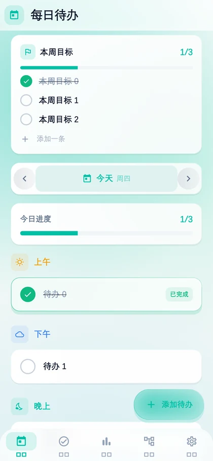
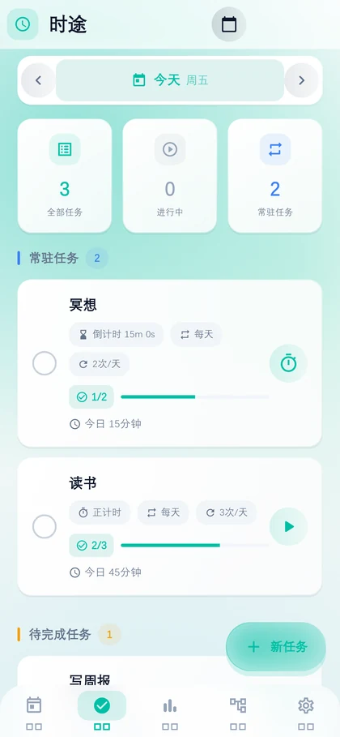
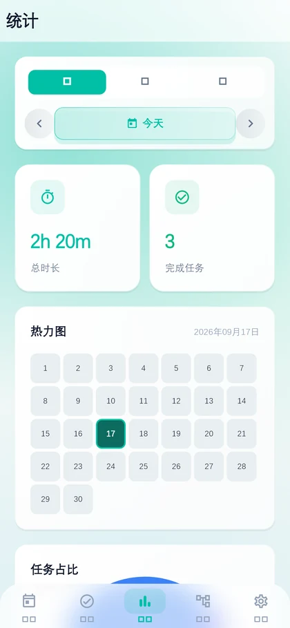
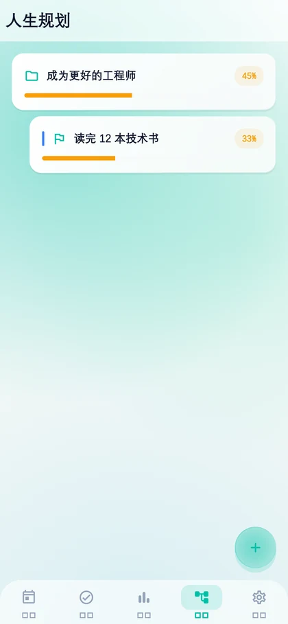

<div align="center">


# 时途 TimeWayPro

**时间规划与人生规划助手**

给任务计时 · 记录真实用时 · 看清时间去向

[](https://flutter.dev)
[](https://dart.dev)
[](#环境要求)
[](#版本迭代)

<p>
  
  
  
  
</p>

</div>

---

## 简介

TimeWayPro（中文名「时途」）是一款基于 Flutter 开发的时间管理应用。

它的核心逻辑很简单：**给任务计时 → 把每一段实际用时记录下来 → 用统计图表告诉你时间究竟花在了哪里**。在此之上，再挂载「人生规划」的目标树与「每日待办」的轻量清单，兼顾长期方向与当天节奏。

与常见的待办清单不同，时途不满足于「打勾」，而是记录**每件事真实消耗了多少时间** —— 这些记录会沉淀为热力图、饼图和任务明细，让「我很忙」变成「我忙在了这件事上，一共 3 小时 20 分」。

界面在 1.3.0 重做为**浅色极光玻璃**：缓慢漂移的青绿光晕托着一层磨砂卡片。设计取舍写在下面的[设计系统](#设计系统)一节。

---

## 功能特性

### ⏱ 任务 · 计时

应用的核心模块。

- **两种计时模式** —— 正计时记录实际耗时；倒计时到点自动完成任务
- **多任务并行计时** —— 多个任务可同时处于计时状态，互不干扰
- **后台计时与状态恢复** —— 计时状态持久化，杀掉 App 后重启自动恢复并继续；超过 24 小时的异常计时自动归档
- **暂停 / 继续** —— 中途暂停，恢复后继续累计
- **重复任务** —— 不重复 / 每天 / 每周 / 每月，可设每日重复次数，跨天自动重置完成次数
- **截止日期与提前提醒**
- **计时记录** —— 每次计时生成一条独立记录（开始 / 结束 / 时长），作为统计模块的数据源

### 📊 统计

- **日 / 周 / 月**三个维度切换，支持前后翻页与直接选日期查看历史
- **概览** —— 区间总时长、完成任务数（切日期时数字滚动）
- **热力图** —— 按月着色，日模式下展示整月网格并高亮当前选中日
- **任务占比饼图** —— 各任务耗时占比，切片标签按底色亮度自动择色
- **任务明细** —— 按耗时排序的列表与占比进度条

### 🎯 人生规划

- **任意层级的目标树** —— 目标可无限层级向下拆分（大目标 → 阶段 → 具体事项）
- **进度管理** —— 每个节点独立调整进度（0% ~ 100%），进度条按区间着色
- **树状图展示** —— 层级以缩进 + 色条呈现
- **级联删除** —— 删除父目标时递归清理所有子目标

### 📝 每日待办

- **独立于任务模块的轻量清单** —— 按日期存储，适合当天临时事项
- **本周目标** —— 页首一张卡记录「这周大概要完成什么」，逐条勾选，勾选进度即完成度。只显示本周，旧周数据保留
- **时间段分类** —— 上午 / 下午 / 晚上三段分组，添加时自动定位当前时段
- **完成进度** —— 点击圆圈勾选，顶部进度条实时显示今日完成度
- **滑动删除**（带二次确认）与**长按编辑**

### ☁️ 数据同步与备份

- **坚果云 WebDAV 同步** —— 一键备份 / 恢复，配置步骤见[下文](#坚果云同步配置)
- **本地导入导出** —— 导出为 JSON 文件、从 JSON 文件导入
- **自动备份机制** —— 本地写入前留存上一份数据，读取失败时自动回滚

### 🔔 通知栏常驻通知

- 计时进行中在通知栏常驻显示任务名称与计时，每 5 秒更新
- App 被杀死后重启，通知自动恢复

---

## 版本迭代

### v1.3.1 — 一致性与本周目标
*2026-09-17*

**新增**

- 待办页新增「本周目标」：可勾选的周目标清单，勾选进度即完成度。只显示本周，旧周数据保留可回溯

**一致性修复**

- **顶栏图标**：5 个 Tab 里只有前两个带图标徽标。而且 `GlassAppBar` 在没传图标时连占位都不渲染，导致后三页的标题整体靠左约 40px —— 不只是少了图标，是标题位置都没对齐
- **圆角按控件角色统一**：chip 竖排的硬编码 14、两个「滑动指示块」一个 9 一个 12、任务卡与统计概览卡用 20 而同类的待办 / 规划卡是 16、完成勾选钮两页尺寸与颜色都不同、规划页有个按钮就地覆盖了主题圆角

**应用图标**

- 设计并生成全套图标：青绿径向渐变底 + 不闭合的圆环，缺口端点的圆点是「当下」
- 补上 **Android 自适应图标** —— 此前完全缺失，Android 8+ 上系统会把那张方图缩小塞进白底形状
- 应用名从包名 `time_way_pro` 改为「时途」

**工程**

- 抽出 `lib/core/utils/week.dart`：「本周周一是哪天」原先在统计页内联重复了 4 处
- `DatabaseHelper` 的表清单原先在文件里重复 6 次（加一张表要同步改 5 个地方），收敛为一处；顺带修掉 `importAll` 不跑兜底、导入旧备份后新表键缺失的问题

### v1.3.0 — 浅色极光玻璃
*2026-09-17*

界面重做，并借此建立了一套设计系统。**功能逻辑完全没动，只改表现层。**

**界面**

- 极光背景层：三个缓慢漂移的光斑（48 秒周期），视觉上是氛围而不是噪音
- 磨砂玻璃：顶栏、底部导航、底部弹窗、FAB 四处用真高斯模糊；滚动列表里的卡片改用「渐变内高光描边 + 半透明填充」的仿玻璃
- 底部导航：滑动指示块 + 图标交叉淡入，取代原先「只有背景色在变 + 图标硬切换」
- 动效：列表错峰入场、按下回弹、统计数字滚动

**设计系统**

- 抽出令牌层（颜色 / 圆角 / 间距 / 阴影 / 文字），收敛原先散落在页面里的 153 处圆角字面量、约 90 处间距、93 处硬写 `TextStyle`
- 抽出玻璃组件层，取代 15 处重复的卡片装饰、7 处底部弹窗、6 处手写顶栏、3 处自绘 chip

**自适应降级**

- 按真实光栅化耗时自动降档：p90 超过 20ms 停极光动画，超过 28ms 再关掉真模糊。只降不升，避免档位抖动
- 系统的「减弱动效」开关也会触发降级

**新增**

- 统计页日期导航：前 / 后一天、周、月切换，可直接选日期
- 热力图「日」模式改为展示整月网格并高亮选中日

**修复**

- 饼图切片标签原先是硬编码白色，在浅黄 / 浅蓝这类切片上完全读不出，改为按底色亮度择色
- 热力图色阶从 10 档压到 5 档，并修掉一处会越界崩溃的下标取值

**清理**

- 删除死代码 `timer_screen.dart`（306 行，且是重复的第二套计时实现）
- 移除零引用依赖 `go_router` / `crypto`

### v1.2.0 — 每日待办
*2026-08-02*

- 每日待办：独立界面，与任务 / 统计 / 规划模块无关
- 时间段分类（上午 / 下午 / 晚上）、点击勾选完成、今日进度
- 滑动删除、长按编辑
- 通知栏常驻通知与 Android 13+ 通知权限申请

### v1.1.0 — 通知栏常驻通知
*2026-08-02*

**新增**：计时中在通知栏常驻显示；每 5 秒更新；杀掉 App 后重启自动恢复

**修复**：每日完成次数自动重置、后台计时准确性、杀掉 App 后计时状态恢复、统计页面频繁刷新、坚果云同步稳定性、并发数据安全性

### v1.0.0 — 初始版本
*2026-08-01*

任务管理（正 / 倒计时、重复规则）、统计面板（热力图 / 扇形图 / 明细）、人生规划（层级拆分与树状展示）、坚果云 WebDAV 同步、后台计时、每日重置

---

## 设计系统

1.3.0 把原先手写的、散落各处的样式收敛成了一套令牌 + 组件。这部分不只是"好看"，有几条约束是硬性的。

### 令牌

| 类别 | 位置 | 说明 |
| --- | --- | --- |
| 颜色 | `lib/core/theme/app_colors.dart` | 含玻璃与极光专用色 |
| 圆角 | `lib/core/theme/app_radius.dart` | `xs 4` / `sm 8` / `md 12` / `lg 16` / `xl 20` / `sheet 28` |
| 间距 | `lib/core/theme/app_spacing.dart` | 4pt 网格 + 语义常量（`screenH` / `cardPad` / `navInset`） |
| 阴影 | `lib/core/theme/app_shadows.dart` | `e1`（静置卡片，blur 12 封顶）/ `e2`（浮起表面）/ `tint(c)` |
| 文字 | `lib/core/theme/app_text.dart` | 15 档 M3 槽位 + 7 档补充样式 |

令牌全部是编译期常量，页面不通过 `Theme.of(context)` 取样式——这样绝大多数样式能保持 `const`。

### 玻璃的对比度约束

这是浅色玻璃方案能不能成立的前提。卡片填充是 78% 白，叠在极光之上合成底色亮度约 0.96，于是：

| 前景色 | 对比度 | 结论 |
| --- | --- | --- |
| `textPrimary` | ≈ 16.8:1 | AAA |
| `textSecondary` | ≈ 4.7:1 | AA，**余量很窄** |
| `textHint` | ≈ 3.1:1 | 仅限 ≥18px 或纯装饰 |

由此定了两条硬性规则，写在代码注释里并有测试守护：

- **`textHint` 不得用于承载语义的小字**
- **极光光斑的 alpha 上限 0.45**，超过后正文跌破 AA

如果真机强光下仍偏灰，单点旋钮是 `glassFill` 的 alpha（0.78 → 0.86），不需要动任何组件。

### 真模糊用在哪

`BackdropFilter` 是一次 GPU 高斯模糊，代价真实。所以只在四个固定表面用（顶栏 16 / 底部导航 18 / 底部弹窗 24 / FAB 16，sigma 上限 24），**滚动列表里的卡片一律用仿玻璃**——十几张卡同时模糊会让中低端机掉帧，而视觉上几乎分辨不出。

每个模糊表面都包 `RepaintBoundary`（Flutter 文档明确要求，否则兄弟节点每帧都会触发重模糊）。

### 玻璃的视觉配方

高光描边用的是 `LinearGradient`（左上 95% 白 → 右下 30% 白），不是 `Border.all(white)`。均匀白环在白底区域完全不可见、在青绿区域才可见，看起来像"缺了一块"；渐变描边模拟"光从左上打来"，这才是玻璃质感的来源。

---

## 技术栈

| 用途 | 依赖 |
| --- | --- |
| 框架 | Flutter 3.44（Dart SDK `^3.12.2`） |
| 状态管理 | `provider` |
| 图表 | `fl_chart` |
| 本地通知 | `flutter_local_notifications` |
| 云同步 | `webdav_client`（WebDAV 协议） |
| 本地存储 | `path_provider` + `shared_preferences` + JSON 文件 |
| 文件选择 | `file_picker` |
| 其他 | `intl`、`uuid` |

**零 UI 动画库** —— 极光、错峰入场、按下回弹、数字滚动全部用 Flutter 原生能力实现。

## 项目结构

```
lib/
├── main.dart                          应用入口：初始化通知与视觉效果档位
├── app/
│   ├── app.dart                       全局 Provider 注册与主题装配
│   └── main_screen.dart               主界面：极光层 + 五 Tab + 底部导航
├── core/
│   ├── theme/                         设计令牌：颜色 / 圆角 / 间距 / 阴影 / 文字
│   │   └── app_theme.dart             装配层，重新导出全部令牌
│   └── ui/                            玻璃设计系统
│       ├── aurora_background.dart     极光背景层
│       ├── glass_surface.dart         玻璃配方（8 个组件共用）
│       ├── glass_card / app_bar / sheet / nav_bar / chip / fab / icon_button
│       ├── segmented_control.dart     带滑动指示块的分段控件
│       ├── pressable_scale.dart       按下回弹
│       ├── staggered_entrance.dart    列表错峰入场
│       ├── count_up_text.dart         数字滚动
│       └── ui_effects.dart            按真实帧耗时自适应降级
├── shared/
│   ├── database/database_helper.dart  数据层：内存 + JSON 文件持久化
│   └── services/notification_service.dart
└── features/                          按功能模块划分
    ├── daily/         每日待办
    ├── task/          任务与计时
    ├── statistics/    统计
    ├── planning/      人生规划
    └── settings/      设置、云同步、导入导出
```

每个功能模块采用 `data（模型 + 仓储）/ providers（状态）/ presentation（界面）` 的分层结构。

---

## 快速开始

### 环境要求

- Flutter SDK（stable 渠道）
- Dart SDK `^3.12.2`
- Android SDK，**minSdk 24**（Android 7.0）
- 可见效的视觉效果需要 OpenGL ES 2.0 以上（任何 2016 年后的设备都满足）

### 运行与构建

```bash
# 拉取依赖
flutter pub get

# 运行到已连接的设备
flutter run

# 构建 Android 安装包
flutter build apk --release
# 产物：build/app/outputs/flutter-apk/app-release.apk
```

### 测试

```bash
flutter analyze          # 当前基线：0 error / 0 warning
flutter test             # 75 个测试
```

另有两类不在默认 test run 里的 golden（文件名不以 `_test.dart` 结尾，避免像素跨平台漂移影响别人的机器）：

```bash
# 玻璃设计系统的视觉探针 + 各 Tab 截图（后者用于生成本文档的配图）
flutter test test/golden/glass_gallery.golden.dart --update-goldens
flutter test test/golden/app_with_data.golden.dart --update-goldens
flutter test test/golden/screenshots.golden.dart --update-goldens
python tool/make_readme_shots.py     # 把截图缩成 README 用的 WebP

# 重新生成应用图标（改设计参数后跑这个，各平台资源一并重出）
python tool/make_app_icon.py
```

---

## 数据存储

应用的所有数据保存在本地**单个 JSON 文件**中：

```
<应用文档目录>/time_way_pro_data.json
<应用文档目录>/time_way_pro_data.json.bak   # 上一份数据，用于异常回滚
```

文件内包含五张逻辑表：

| 表名 | 说明 |
| --- | --- |
| `tasks` | 任务定义（计时模式、重复规则、完成次数等） |
| `task_records` | 计时记录（每次计时的开始 / 结束 / 时长） |
| `plans` | 人生规划目标（含父子层级） |
| `daily_tasks` | 每日待办 |
| `sync_config` | 云同步配置 |

每次写入前会先把现有文件复制为 `.bak`，下次启动读取失败时自动从备份回滚。

---

## 坚果云同步配置

时途通过**坚果云开放的 WebDAV 接口**实现云端备份与恢复。

1. 登录坚果云网页版
2. 进入「账户信息 → 安全选项 → 第三方应用管理」
3. 添加一个应用密码并复制
4. 打开时途 →「设置 → 云端同步 → 配置坚果云同步」
5. 填入以下信息，点「保存并测试连接」：

   | 字段 | 填写内容 |
   | --- | --- |
   | WebDAV 地址 | `https://dav.jianguoyun.com/dav/`（默认已填） |
   | 用户名 | 坚果云账号邮箱 |
   | 应用密码 | 上一步生成的密码（**不是**登录密码） |

连接成功后即可执行「立即备份」与「恢复数据」。备份文件写入坚果云根目录的 `backup.json`，失败时回退到 `TimeWayPro/backup.json`。

> ⚠️ **恢复操作会全量覆盖本地所有数据**，包括同步配置本身。

---

## 权限说明

| 权限 | 用途 |
| --- | --- |
| `INTERNET` | WebDAV 云同步 |
| `ACCESS_NETWORK_STATE` | 检测网络状态 |
| `POST_NOTIFICATIONS` | 计时状态的通知栏常驻通知（Android 13+ 需动态申请） |
| `FOREGROUND_SERVICE` | 保障后台计时 |
| `WAKE_LOCK` | 保障后台计时不被系统休眠中断 |

---

## 注意事项

**平台**

开发与验证以 **Android** 为主。工程目录包含 iOS / Linux / macOS / Web / Windows 的平台脚手架，但尚未在这些平台上适配验证——其中 Windows 桌面还无法运行，因为 `flutter_local_notifications` 没有 Windows 实现。

**安全**

`sync_config` 表（含坚果云账号与应用密码，**明文**）会随导出数据一起写进备份文件。把备份文件分享给别人等同于分享了你的坚果云访问凭据。

**构建**

`android/app/build.gradle.kts` 没有配置 `signingConfig`，因此 release 包用的是 Flutter 默认的调试签名。自己侧载没问题，但不能上架应用商店；且更换签名后覆盖安装会失败（需先卸载）。

---

## 许可证

本项目尚未指定开源许可证。